# MAKIRE MOTORPARTS — Entity Relationship Diagram

This ERD reflects the implemented Prisma schema in `server/prisma/schema.prisma`
exactly. Table names, columns, and cardinalities match the generated migration in
`server/prisma/migrations/`.

## Legend

- `1`..`*` one-to-many; `1`..`1` one-to-one; `*`..`*` many-to-many (through a
  join table).
- All IDs are `cuid()` strings. Money is `numeric(12,2)` (Prisma `Decimal`).
- Check constraints listed in the migration enforce non-negative balances,
  non-negative prices/costs, positive quantities, and that accepted quantities
  never exceed received quantities.

```mermaid
erDiagram
    User ||--o{ User : "createdBy (self)"
    User ||--o{ AuditLog : "user"
    User ||--o{ Notification : "user"
    User ||--o{ PasswordResetToken : "user"
    User ||--o{ PurchaseOrder : "createdBy"
    User ||--o{ Purchase : "createdBy"
    User ||--o{ PurchaseReturn : "createdBy"
    User ||--o{ Sale : "createdBy"
    User ||--o{ SaleReturn : "createdBy"
    User ||--o{ Payment : "createdBy"
    User ||--o{ CustomerCreditPayment : "createdBy"
    User ||--o{ SupplierCreditPayment : "createdBy"
    User ||--o{ Expense : "createdBy"
    User ||--o{ InventoryTransaction : "createdBy"
    User ||--o{ StockReservation : "createdBy"

    Category ||--o{ Category : "parent"
    Category ||--o{ Product : "category"
    Brand ||--o{ Product : "brand (optional)"

    Product ||--o{ ProductIdentifier : "product"
    Product ||--o{ SupplierProduct : "product"
    Product ||--o{ PurchaseOrderItem : "product"
    Product ||--o{ PurchaseItem : "product"
    Product ||--o{ PurchaseReturnItem : "product"
    Product ||--o{ SaleItem : "product"
    Product ||--o{ SaleReturnItem : "product"
    Product ||--o| Inventory : "product"
    Product ||--o{ InventoryTransaction : "product"
    Product ||--o{ StockReservation : "product"
    Product }o--o{ MotorcycleVariant : "compatibility (ProductCompatibility)"

    MotorcycleMake ||--o{ MotorcycleModel : "make"
    MotorcycleModel ||--o{ MotorcycleVariant : "model"

    Supplier ||--o{ SupplierProduct : "supplier"
    Supplier ||--o{ PurchaseOrder : "supplier"
    Supplier ||--o{ Purchase : "supplier"
    Supplier ||--o{ PurchaseReturn : "supplier"
    Supplier ||--o| SupplierCreditAccount : "supplier"

    PurchaseOrder ||--o{ PurchaseOrderItem : "purchaseOrder"
    PurchaseOrder ||--o{ Purchase : "purchaseOrder (optional)"
    PurchaseOrderItem ||--o{ PurchaseItem : "purchaseOrderItem (optional)"
    Purchase ||--o{ PurchaseItem : "purchase"
    Purchase ||--o{ PurchaseReturn : "purchase"
    Purchase ||--o{ SupplierCreditPayment : "settles (optional)"
    PurchaseItem ||--o{ PurchaseReturnItem : "purchaseItem"
    PurchaseReturn ||--o{ PurchaseReturnItem : "purchaseReturn"

    Inventory ||--o{ InventoryTransaction : "inventory (optional)"
    Inventory ||--o{ StockReservation : "reserved"

    Customer ||--o{ Sale : "customer (optional)"
    Customer ||--o{ SaleReturn : "customer (optional)"
    Customer ||--o| CustomerCreditAccount : "customer"

    Sale ||--o{ SaleItem : "sale"
    Sale ||--o{ Payment : "sale"
    Sale ||--o{ SaleReturn : "sale"
    SaleItem ||--o{ SaleReturnItem : "saleItem"
    SaleReturn ||--o{ SaleReturnItem : "saleReturn"

    CustomerCreditAccount ||--o{ CustomerCreditPayment : "account"
    SupplierCreditAccount ||--o{ SupplierCreditPayment : "account"

    ExpenseCategory ||--o{ Expense : "category"
```

## Entity list

| Entity | Purpose |
|--------|---------|
| User | Staff accounts (ADMIN / ASSISTANT roles). No role/permission tables. |
| AuditLog | Immutable history of important actions (never passwords/secrets). |
| PasswordResetToken | One-time, expiring, single-use password reset tokens; stores only the SHA-256 hash of the raw token. |
| Notification | In-app alerts (low stock, out of stock, credit due, PO pending, etc.). |
| Setting | Business configuration key/value store (no secrets). |
| DocumentSequence | Concurrency-safe sequential document numbering (SALE, PO, PURCHASE, ...). |
| Category / Brand | Product catalog grouping and optional branding. |
| Product | Spare part: SKU, prices, minimum stock, reorder level, status. |
| ProductIdentifier | Multiple searchable identifiers per product (PART_NUMBER, OEM_NUMBER, ALTERNATIVE_NUMBER, SUPPLIER_NUMBER, OTHER). |
| MotorcycleMake/Model/Variant | Optional motorcycle compatibility taxonomy. |
| ProductCompatibility | Many-to-many join between Product and MotorcycleVariant. |
| Supplier / SupplierProduct | Vendors and per-supplier product references. |
| PurchaseOrder / PurchaseOrderItem | What was ordered (historical). |
| Purchase / PurchaseItem | What was actually received (supports partial receiving; inventory increases only by quantityAccepted). |
| PurchaseReturn / PurchaseReturnItem | Returns to suppliers. |
| Inventory / InventoryTransaction | Current stock state and the full ledger of every movement. |
| StockReservation | Optional reservation support (reserved stock). |
| Customer | Optional credit/wholesale customers (walk-in sales need no customer). |
| Sale / SaleItem | POS/wholesale sales with frozen prices, discounts, and returns. |
| Payment | Split payments across methods (CASH, MPESA, AIRTEL_MONEY, BANK, OTHER). |
| SaleReturn / SaleReturnItem | Customer returns referencing original sale items. |
| CustomerCreditAccount / CustomerCreditPayment | Customer credit balances and payments. |
| SupplierCreditAccount / SupplierCreditPayment | Supplier credit balances and payments; Purchase remains the source transaction. |
| ExpenseCategory / Expense | Operating expenses (no full general ledger). |

## Financial integrity

- All money is `Decimal` (numeric) — never floats.
- Sale items and purchase items freeze unit prices/costs at transaction time.
- Product's current retail/wholesale prices are *not* used as historical cost.
- Costing method is **weighted-average cost**, to be implemented in a later
  business-service stage using `PurchaseItem.unitCost` and `quantityAccepted`;
  no cost ledger table is created prematurely.
- Supplier/customer credit balances are stored for query performance and kept in
  sync transactionally by services; they can be reconciled against the summed
  transactions.

## Search & indexing decisions

- Product name: B-tree index for prefix search; fuzzy full-text search can be
  added with the `pg_trgm` GiST extension if the business needs it (later).
- Product SKU: unique index (exact match).
- ProductIdentifier.value: B-tree index + unique (type, value) — fast lookup by
  any part/OEM/alternative/supplier number.
- SupplierProduct.supplierPartNumber: B-tree index.
- Motorcycle make/model/variant names: indexes + unique constraints.
- Transaction tables (Sales, Purchases, Purchases returns, Expenses) indexed on
  date + status for reporting.
- InventoryTransaction: composite (productId, createdAt) index for ledger scans.

## Delete/update strategy

- Business records (Product, Supplier, Customer, Purchase, Sale, etc.) are never
  physically deleted. References from transactions use `ON DELETE RESTRICT` so
  historical data can never be silently destroyed.
- Soft deactivation via status enums (`ACTIVE`/`INACTIVE`) for Products,
  Suppliers, Customers; `ARCHIVED`-style states represented where statuses apply.
- Line items cascade with their parent headers; optional links (PurchaseOrder,
  purchaseOrderItem, inventory) use `ON DELETE SET NULL` so history remains
  readable even if the parent reference is removed.
## Stage 8 schema additions

One additive migration (`202608210003_stage8_purchase_returns`) extends the
existing `purchase_returns` table (modelled since Stage 2) with settlement
columns, and registers the `PURCHASE_RETURN` document sequence:

- `creditedAmount numeric(12,2) NOT NULL DEFAULT 0` — the portion of the
  return total settled against an active supplier credit account (clamped at
  the account's outstanding balance; never negative).
- `refundMethod "PaymentMethod" NULL` — how a cash refund was or will be paid
  (`REFUND` settlement only).
- `refundReference text NULL` — provider/transaction reference for that refund.
- `document_sequences` gains one row: `PURCHASE_RETURN`, prefix
  `PURCHASE_RETURN`, zero-padded to 6 digits.

No other tables changed. Notifications and Settings were modelled in Stage 2
and simply gained their API surface in Stage 8.
